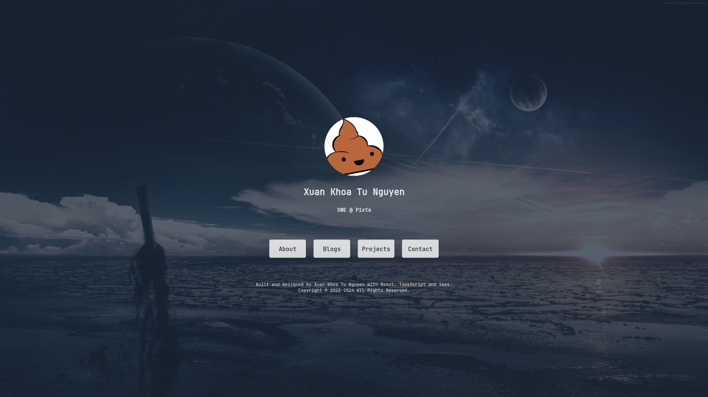

# Tuslipid

My personal website :poop:

This project is:

- Bootstrapped by [React](https://react.dev/), [TypeScript](https://www.typescriptlang.org/)
and [SASS](https://sass-lang.com/)
- Built on top of [Next.js](https://nextjs.org/)
- Deployed by [Vercel](https://vercel.com/)

## Menu Preview


## Running locally

- Install dependencies

```bash
npm install
```
Or if you have Bun

```bash
bun install
```

- Development

```bash
npm run dev
```
```bash
bun run dev
```

- Compile Sass main

```bash
npm run style:main
```
```bash
bun run style:main
```

- Compile Sass markdown for blog sites

```bash
npm run style:md
```
```bash
bun run style:md
```

## For fun: What I have learned just by creating this?

- React
- SEO
- Client-side rendering, pre-rendering, server-side rendering
- Authentication with oauth (by the deprecated *Guestbook*)
- *Before doing something creative, don't do anything wrong* (Why do frontend developers always
complain their works?) :poop:
- A lot of SASS and CSS
- How to write blogs?
- How to create a blog site
- How to marketing myself :triumph:
- Code conventions

> Don't be mistaken, I'm not a frontend developer, I do much more backend works. Frontend stuffs
> are just my hobby.
